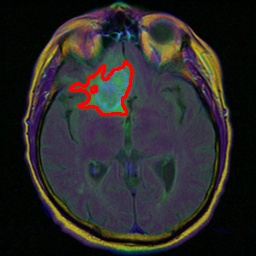
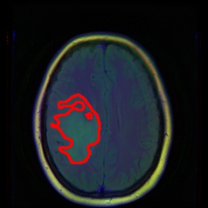

# Tumor Semantic Segmentation

[](https://github.com/jriverosesma/python-project/actions/workflows/unit_tests.yaml)
[](LICENSE)
[](https://github.com/Lightning-AI/pytorch-lightning)
[](https://github.com/facebookresearch/hydra)
[](https://github.com/aimhubio/aim)


<div align="center">
     
     
    
</div>

## Table of contents
1. [Overview](README.md#1-overview)  
2. [Installation](README.md#2-installation)  
3. [Quickstart](README.md#3-quickstart)
4. [Features](README.md#4-features)
5. [Running tests](README.md#5-running-tests)

## 1. Overview

This is a lightweight and flexible Semantic Segmentation framework for MRI tumor detection on [LGG MRI Segmentation Dataset](https://www.kaggle.com/datasets/mateuszbuda/lgg-mri-segmentation).

We can easily extend the framework to new datasets thanks to Lightning datamodules.

<br>
<div align="center">
    <table>
        <tr>
            <td></td>
            <td></td>
            <td rowspan="2"></td>
        </tr>
        <tr>
            <td></td>
            <td></td>
        </tr>
    </table>
</div>

## 2. Installation

```bash
git clone https://github.com/jriverosesma/tumor-semantic-segmentation
conda create -n tumor-semseg python=3.10 --no-default-packages -y
conda activate tumor-semseg
python -m pip install --upgrade pip
pip install torch torchvision --index-url https://download.pytorch.org/whl/cu118
pip install -e .[all]
pre-commit install
```

## 3. Quickstart

### 3.1 Notebook

Check the Kaggle notebook [here](notebooks/kaggle_tutorial.ipynb) for a practical example on how to use the framework ⭐

### 3.2 Step by step

1. Follow the [installation instructions](README.md#2-installation).
2. Download and extract dataset from [Kaggle](https://www.kaggle.com/datasets/mateuszbuda/lgg-mri-segmentation).
3. Specify the `dataset_dirpath` in the [main configuration file](tumor_semseg/configuration/main.yaml).
4. Train using `semseg_train` command. Run `aim up` in a different terminal to keep track of the training using Aim logger.
5. Replace `checkpoint` in the [main configuration file](tumor_semseg/configuration/main.yaml) by the path of the checkpoint saved after training. The best and last epoch models are saved by default in `.aim/<experiment_name>/<run_id>`.
6. Run model evaluation using `semseg_eval`.
7. Run inferences using `semseg_infer`.
8. Export the model to ONNX using `semseg_export`.

### 3.3 Pre-trained models

Replace `checkpoint` in the [main configuration file](tumor_semseg/configuration/main.yaml) by the path to the torch .ckpt checkpoint.

UNet++ with MobileNetv2 encoder:

- Torch checkpoint: [epoch=26-val_mIoU=0.91.ckpt](https://www.kaggleusercontent.com/kf/159533799/eyJhbGciOiJkaXIiLCJlbmMiOiJBMTI4Q0JDLUhTMjU2In0..KX0HyxlpF9eDEIBs4V_Scg.fvs_kKGsskLYpv-RJz7rl_XDo-LIy8rF6vjSfq0ahpBrz0bxRmysJRtz3t4Tlz-x53YSXwoIzQEZ2BUcIy6uWAuZnB2GmnpP2f7atT-GOW73bF0w9ru3qHMH2ENAypfu8IynqC_eXMObtvqbKoFLs_kI4hthLquEOvi1nS2Ficj14OnymOFSA7hyNNzw3-o-_MS7MKgtWW6rSS5M0wCbup7Gpsz-UCKiQUsrU7_lgOoffBi4a99dTaBTdr5TfSTkcu_6tXvgvT3G6j8yYpBTW3iRRAodCv-40jv6v9NI7TekU_MB5HpJCVsv_TqJw-Z2tPmchZeWB418sN-jMvwKz1tp0PJ-HyzTMgOfNPYAYcWo3k_UM99T3g0v539GqKL5MXrm-JjDJ7ZWuWTwkFef3J2guhVm2y_aP4swrfCCH-8l1x9boiLxVuAohJ1dgx12H95eoBurnhJmOCl-t0_sjiYCVQEJUGlMmLp5oq6MpG8MfsF5lV6I58aPi0WQQnnspLATDM-n4TLsT-qtA9vOd_3nLp9OOkCiSBgaeOuzf87EUitHCBcXZkl0vw7oUZy57LfW5bJw8ipbWpols5NE15n5JnsWN9MIILJpqbD5Smrq33YNjwqiNMriu4RbGSnQSjTZXFQt1gqhDGyHo2wmKLOIGaJ3o3lk5qhCp5nBe5gwQnNv1ZUxoXK-3fWJr_qn.8MflxhMD6qeFSHB_j_yc5w/tumor-semseg/.aim/tumorsemseg/1ae9d9b971f1449d92644e55/checkpoints/epoch=26-val_mIoU=0.91.ckpt)

- ONNX checkpoint: [epoch=26-val_mIoU=0.91.onnx](https://www.kaggleusercontent.com/kf/159533799/eyJhbGciOiJkaXIiLCJlbmMiOiJBMTI4Q0JDLUhTMjU2In0..QrDrKDmL2gsZbfVW87kNkA.FudkLuREwbmJKSXq5Fi8xebdpMtIuXaL73y8IRmZ_0GTvhqU5NY-6O1x2VuJRkn-rZrK1Vmqdt_NMjn1osxr9L4QQHtU223qMHc45HZroYnOxBvRRvqxm0xYNy0VVeR23b5s-szXu95frWUheTWYc7j5NWUmXJ-sgHtjSNrj9Z9FE2MeajFWCNhZR2IkQp65_mvstEIyGeXtzl02FWPpe3N6RO2kMmXJDhXN9jwQGiJt63c6Af_gYZBo7EMR2xtiyfg088oQVJp-G7XdhrnG9Hco3zybtYgCTqbidX5dYrq7LA3rRHl6xdzuJikdweD_DYi31tMpKcXH7lQ3Grf0bMA25SJqqgMhfYirIS0LfNuqdcBHqL1pTCCV-IAllP5_A7nGnBGdNjAErfm4Ixh6aFdGthlT5k1gWJCZnlrKLdv7VOMpMU4tKL5oGXY9QA5EtwFvMfB0m2OLFM8E1SStNpSSLTUB_9NiGoXblCJmTEUE8S05uUlQAq_v4EC1x4BSQ_gSBSy4Hbfd12p2bxs3J0j4q9z0RMJ0K2OeKLsmW_y81qN2G7ut07S3BEBHrYMjk_KTf4eTtLr3xhN0OvNJ4Lx4UJcPTYMKyLt4KU1MwpftcWkNFfHmwK88wibldL24q0ZQyE1SRtSQfgY-2F9WtsrFP5V1hP7nWzn6ARJTIfjeAmFB1soLiF51_pLRyBOv.wAxvxeR6rf4gNTxlXxj5Bw/tumor-semseg/.aim/tumorsemseg/1ae9d9b971f1449d92644e55/checkpoints/epoch=26-val_mIoU=0.91.onnx)

## 4. Features

- Training powered by [Lightning](https://github.com/Lightning-AI/pytorch-lightning) ⚡
- Easy configuration management using [Hydra](https://github.com/facebookresearch/hydra) ⚙️
- Supercharged logging using [Aim](https://github.com/aimhubio/aim) 🗃
- Ready to use scripts: 
    - Train from scratch or from a checkpoint: `semseg_train`.
    - Compute metrics for model evaluation: `semseg_eval`.
    - Run inference on images: `semseg_infer`.
    - Export model to ONNX: `semseg_export`.
- Direct integration with [Segmentation Models PyTorch](https://github.com/qubvel/segmentation_models.pytorch) via Hydra config: more than 124 encoders and many model architectures ready to use.
- Hyper-parameter tuning using Optuna plugin for Hydra.
- Model compression:
    - Quantized Aware Training using PyTorch quantization modules.
    - Pruning Aware Training using Lightning callbacks.

## 5. Running tests

Follow the [installation instructions](README.md#2-installation). Then run the following commands from the root of the repository.

```bash
pytest
```

**NOTE**: Make sure to active the conda environment with `conda activate tumor_semseg` before running the tests.
