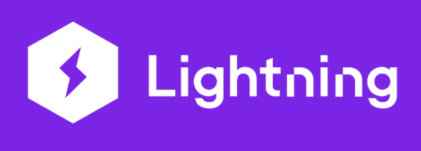

[](https://github.com/jriverosesma/python-project/actions/workflows/unit_tests.yaml)
[](LICENSE)
[](Lightning)
[](Hydra)
[](AimStack)


# Tumor Semantic Segmentation

## Table of contents
1. [Overview](README.md#1-overview)  
2. [Installation](README.md#2-installation)  
3. [Quickstart](README.md#3-quickstart)
4. [Features](README.md#4-features)
5. [Running tests](README.md#5-running-tests)

## 1. Overview

This is a lightweight and flexible Semantic Segmentation framework for MRI tumor detection on [LGG MRI Segmentation Dataset](https://www.kaggle.com/datasets/mateuszbuda/lgg-mri-segmentation). We can easily extend the framework to new datasets thanks to Lightning datamodules.

## 2. Installation

```bash
git clone https://github.com/jriverosesma/tumor-semantic-segmentation
conda create -n tumor-semseg python=3.10 --no-default-packages -y
conda activate tumor-semseg
python -m pip install --upgrade pip
pip install torch torchvision --index-url https://download.pytorch.org/whl/cu118
pip install -e .[all]
pre-commit install
```

## 3. Quickstart
1. Follow the [installation instructions](README.md#2-installation).
2. Download and extract dataset from [Kaggle](https://www.kaggle.com/datasets/mateuszbuda/lgg-mri-segmentation).
3. Specify `dataset_dirpath` in the [main configuration file](tumor_semseg/configuration/main.yaml).
4. Train using `semseg_train` command. Run `aim up` in a different terminal to keep track of the training using AimStack logger.
5. Replace `checkpoint` in the [main configuration file](tumor_semseg/configuration/main.yaml) by the path of the checkpoint saved after training. The epoch and last epoch models are saved in `.aim/<experiment_name>/<run_id>` by default.
6. Run model evaluation using `semseg_eval`.
7. Run inferences using `semseg_infer`.
8. Export the model to ONNX using `semseg_export`.

## 4. Features
The frameworks is based in:
- Lightning for training.
- Hydra for configuration management.
- Aim Stack for logging. 




- Scripts: train, inference, evaluate, export.
- Integration with SMP.
- Easy configuration: Hydra.
- Sweeper.
- QAT.
- Pruning.

## 5. Running tests

Follow the installation instructions. Then run the following commands from the root of the repository.

```bash
pytest
```

NOTE: Make sure to active the conda environment with `conda activate tumor_semseg` before running the tests.
